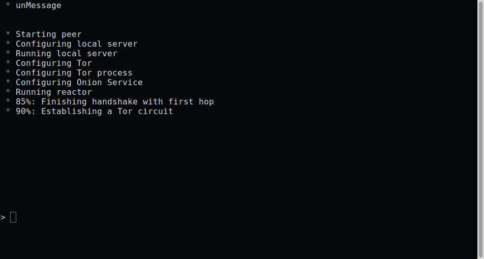
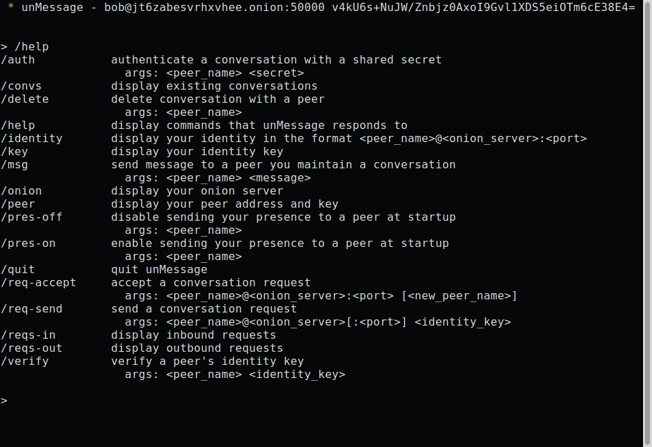
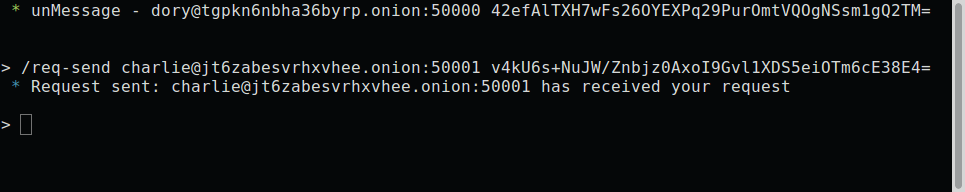
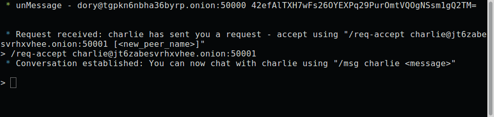
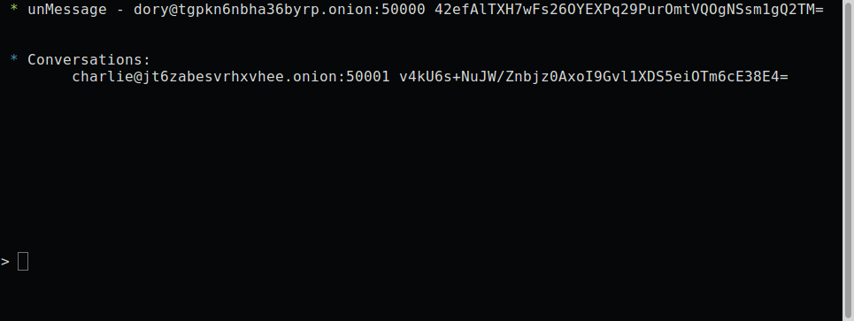
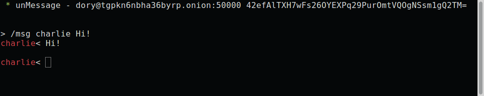
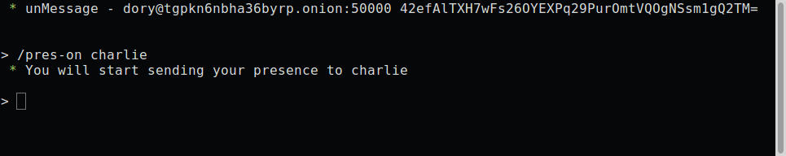
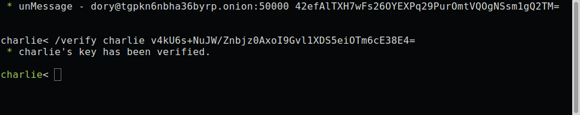
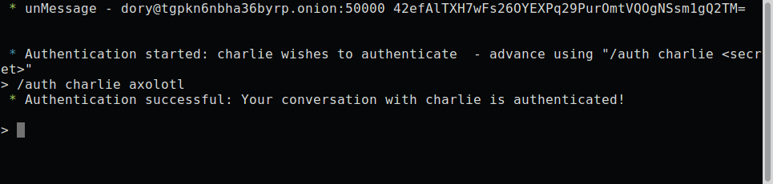

.. _sec-cli:

============================
Command-line Interface (CLI)
============================
To launch unMessage's *CLI*, pick any name you wish to use and call
it with::

    $ unmessage-cli -name <name>

*Tor* is launched and if this is the first time you use that name,
your *Onion Service* and *Double Ratchet* keys are created and you
are ready to receive and send requests to initialize conversations.
unMessage displays this bootstrap process:

   Bootstrap lines

After unMessage is launched, you can call ``/help`` to display all the
commands the *CLI* responds to:

   ``/help`` command

The ``/peer``, ``/onion`` and ``/key`` commands can be used to copy
information the other peers need to send you requests. You must share
both your **identity address** and **key**::

    bob@a7riwene46w3vqhp.onion RefK+9vx3GZpclb/On95iJ1QnxqkUeq/JBYqK5gHFwo=

Sending Requests
----------------
Use the ``/req-send`` command to send a request, providing the
**identity address** and **key** of the peer you wish to contact:

   ``/req-send`` command

An **identity address** is provided in the format
``<name>@<onion address>``, where the ``<name>`` is only a local
identifier of the peer and you can pick any name you wish to call
them.

Receiving Requests
------------------
Inbound requests are notified, with the information of the peer who
sent the request:

   ``/req-accept`` command

As mentioned previously, peer names are local and when accepting a
request you can pick another one to call them instead of using the one
they sent.

Chatting
--------
unMessage diplays each peer you have a conversation with by calling
the ``/convs`` command.

   ``/convs`` command

To send a message to a peer, use the ``/msg`` command:

   ``/msg`` command

Notifying Presence
''''''''''''''''''
If you wish to notify the peer whenever you go online or offline,
use the ``/pres-on`` command and unMessage will start to send them
notifications of these events:

   ``/pres-on`` command

To disable, use the ``/pres-off`` command.

.. _sec-cli-verifying:

Verifying
'''''''''
If you have some secure communication channel established with the
other peer, ask them for their unMessage public identity key. Use the
``/verify`` command and enter the key:

   ``/verify`` command

If the key matches, the peer will be verified and now you have
established a verified and secure communication channel.

.. _sec-cli-authenticating:

Authenticating
''''''''''''''
The authentication of a conversation works by prompting both peers for
a secret (which was exchanged through some other secure channel) and
if the secrets provided match, they are sure they are chatting with
the right person. Call the ``/auth`` command and provide the secret:

   ``/auth`` command

An authentication session is created when the secrets are exchanged
and is valid until one of the peers disconnect. When it happens, the
conversation is not authenticated anymore and a new session must be
initialized when the peers reconnect.

Assuming that one of the peers might be an attacker, this process is
done with the `Socialist Millionaire Protocol`_ by comparing the
secrets without actually disclosing them.

Authentication Levels
'''''''''''''''''''''
As noticed, the names of the peers are colored based on the
conversation authentication levels:

1. Unverified Conversation (red)
2. Verified Conversation (green)
3. Authenticated Conversation (cyan)

When the conversation is established, its level is
**Unverified Conversation** because unMessage does not know if you
are sure that the peer's identity key is actually theirs.

If you follow the :ref:`sec-cli-verifying` section, the level changes
to **Verified Conversation** and it persists for as long the
**conversation** exists.

If you follow the :ref:`sec-cli-authenticating` section, the
level changes to **Authenticated Conversation** and it persists for as
long the **session** exists. Once the **session** is over, the level
drops to the identity key's verification level:
**Unverified**/**Verified**.

.. important::

    The **Authenticated** level is stronger than the **Verified**
    level because the former is a short term verification that lasts
    only until the peers disconnect, while the latter is long term
    that lasts until the conversation is deleted (manually, by the
    user). That means that with a short term verification you are able
    to authenticate the peer at that exact time, while a long term
    verification means that you authenticated the peer in the past,
    but is not aware of a compromise in the future.

    This feature aims to increase unMessage's security by identifying
    an attack that is not covered by the scope of the
    *Double Ratchet Algorithm*: compromised keys.

Relaunching unMessage
---------------------
unMessage remembers the last User Interface and Peer that you used. If
you wish to use a shortcut, you may call::

    unmessage

.. note::

    unMessage's CLI is inspired by `xmpp-client`_.

.. _`socialist millionaire protocol`: https://en.wikipedia.org/wiki/Socialist_millionaire
.. _`xmpp-client`: https://github.com/agl/xmpp-client
