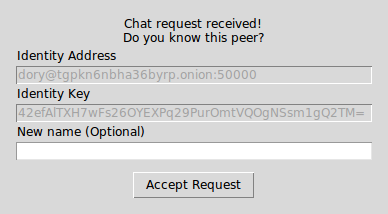

.. _sec-gui:

==============================
Graphical User Interface (GUI)
==============================
Launch unMessage's *GUI* with::

    $ unmessage-gui

You are taken to the ``Start Peer`` tab and you are required to pick any
name you wish to use and press ``Start``:

   Start Peer window

*Tor* is launched and if this is the first time you use that name,
your *Onion Service* and *Double Ratchet* keys are created and you
are ready to receive and send requests to initialize conversations.
unMessage displays this bootstrap process:

   Bootstrap window

The ``Copy`` buttons at the top bar can be used to copy information
the other peers need to send you requests. You must share both your
**identity address** and **key**::

    charlie@jt6zabesvrhxvhee.onion:50001 v4kU6s+NuJW/Znbjz0AxoI9Gvl1XDS5eiOTm6cE38E4=

Sending Requests
----------------
Press the ``New chat`` button at the top bar to open the ``Request``
window. Provide the **identity address** and **key** of the peer you
wish to contact:

   Outbound request window

An **identity address** is provided in the format
``<name>@<onion address>``, where the ``<name>`` is only a local
identifier of the peer and you can pick any name you wish to call
them.

Receiving Requests
------------------
Inbound requests are notified in a new window with the information of
the peer who sent the request:

   Inbound request window

As mentioned previously, peer names are local and when accepting a
request you can pick another one to call them instead of using the one
they sent.

Chatting
--------
unMessage creates tabs for each peer you have a conversation with.
Within each tab, besides composing messages and sending (clicking
``Send`` or pressing the ``Enter`` key) there are some actions
available.

   Chat tab

Notifying Presence
''''''''''''''''''
If you wish to notify the peer whenever you go online or offline,
check ``Send Presence`` and unMessage will start to send them
notifications of these events.

.. _sec-gui-verifying:

Verifying
'''''''''
If you have some secure communication channel established with the
other peer, ask them for their unMessage public identity key. Click
``Verify`` and enter the key:

   Verification window

If the key matches, the peer will be verified and now you have
established a verified and secure communication channel:

   Verified conversation

.. _sec-gui-authenticating:

Authenticating
''''''''''''''
The authentication of a conversation works by prompting both peers for
a secret (which was exchanged through some other secure channel) and
if the secrets provided match, they are sure they are chatting with
the right person. Click ``Authenticate`` and provide the secret:

   Authentication window

An authentication session is created when the secrets are exchanged
and is valid until one of the peers disconnect. When it happens, the
conversation is not authenticated anymore and a new session must be
initialized when the peers reconnect.

   Authenticated conversation

Assuming that one of the peers might be an attacker, this process is
done with the `Socialist Millionaire Protocol`_ by comparing the
secrets without actually disclosing them.

Authentication Levels
'''''''''''''''''''''
As noticed, unMessage conversations have three authentication levels:

1. Unverified Conversation
2. Verified Conversation
3. Authenticated Conversation

When the conversation is established, its level is
**Unverified Conversation** because unMessage does not know if you
are sure that the peer's identity key is actually theirs.

If you follow the :ref:`sec-gui-verifying` section, the level changes
to **Verified Conversation** and it persists for as long the
**conversation** exists.

If you follow the :ref:`sec-gui-authenticating` section, the
level changes to **Authenticated Conversation** and it persists for as
long the **session** exists. Once the **session** is over, the level
drops to the identity key's verification level:
**Unverified**/**Verified**.

.. important::

    The **Authenticated** level is stronger than the **Verified**
    level because the former is a short term verification that lasts
    only until the peers disconnect, while the latter is long term
    that lasts until the conversation is deleted (manually, by the
    user). That means that with a short term verification you are able
    to authenticate the peer at that exact time, while a long term
    verification means that you authenticated the peer in the past,
    but is not aware of a compromise in the future.

    This feature aims to increase unMessage's security by identifying
    an attack that is not covered by the scope of the
    *Double Ratchet Algorithm*: compromised keys.

Relaunching unMessage
---------------------
unMessage remembers the last User Interface and Peer that you used. If
you wish to use a shortcut, you may call::

    unmessage

.. _`socialist millionaire protocol`: https://en.wikipedia.org/wiki/Socialist_millionaire
